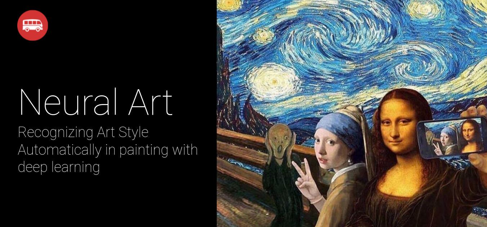

# Install

Clone the project and install it:

```bash
cd neural-art
pip install -e .
```

# Data preparation

Open the notebook notebook/Data preparation.ipynb and follow the instructions.

# Trainer

TODO

# Feature visualization

TODO
