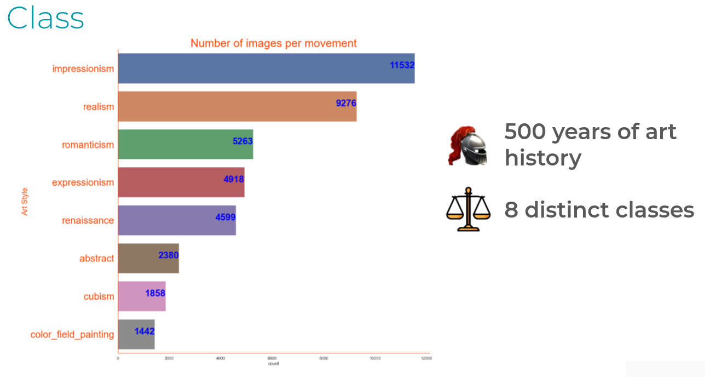
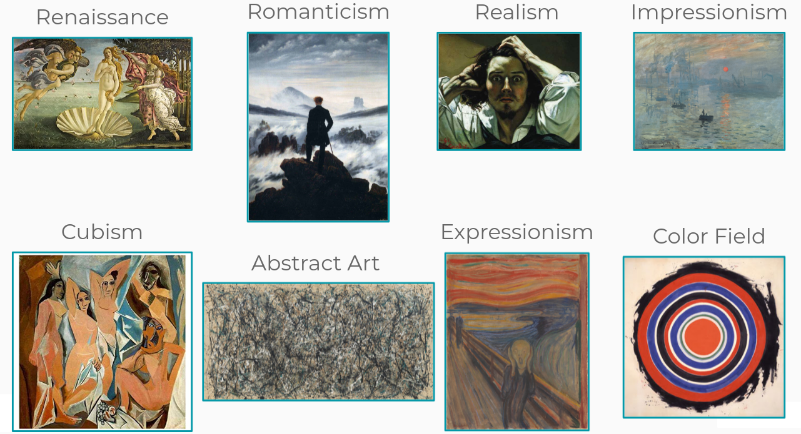
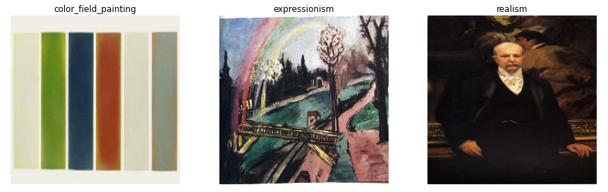

# Setup
## Install the package

Clone the project and install the neural-art package:

```bash
cd neural-art
pip install -e .
```

## Download the data

You can download a sample of the [Wikiart](https://www.wikiart.org/) dataset from the [repository of Professor Chee Seng Chan](https://github.com/cs-chan/ArtGAN/tree/master/WikiArt%20Dataset)

Use this command to download the images (Size = 25.4Gb):

```bash
wget http://web.fsktm.um.edu.my/~cschan/source/ICIP2017/wikiart.zip
```

Use this command to download the csv files:

```bash
wget http://web.fsktm.um.edu.my/~cschan/source/ICIP2017/wikiart_csv.zip
```

Once the downloads are complete, unzip the folders, and move them to the *raw_data* folder of the package

# Data preparation

Once you have downloaded the dataset and installed the package, follow the instructions in the *notebooks/data_preparation.ipynb* notebook to create your train/val/test splits.

The paintings in the Wikiart dataset provided by Professor Chan are categorized into 27 art styles. You can choose to work with all 27 art styles, or merge/drop some styles by playing with the parameters of the `create_dataset` function in the `data` module of the neural-art package.

## Replicate our dataset

On our side, we worked with only 8 distinct art styles. To replicate our dataset, follow the instructions of the section "Replicate our custom dataset of 8 art styles" in the *notebooks/data_preparation.ipynb* notebook.





# Painting style prediction using the neural-art package

In this section, we will now describe how to use the `trainer` module to train classification models on the Wikiart dataset.

- You can directly follow the instructions in the *notebooks/style_prediction_using_neuralart_package.ipynb* notebook to see examples of how to use the `trainer` module.

- You can also follow the instructions in the *notebooks/style_prediction_using_notebook.ipynb* notebook to see examples of how to train models on the Wikiart dataset without using the `trainer` module.

## Initialize the trainer

```python
trainer = Trainer(experiment_name='test_trainer')
```

## Create A TensorFlow Dataset

### Create A TensorFlow Dataset using tf.keras.image_dataset_from_directory()

```python
trainer.create_dataset_from_directory(image_folder_path, batch_size, img_height, img_width)
```

To use this method, you must have created your image folder by setting `flat=False` in the `create_dataset` function of the `data` module.

### Create A TensorFlow Dataset using tf.data.Dataset.from_tensor_slices()

```python
trainer.create_dataset_from_csv(csv_path, image_folder_path, batch_size, img_height img_width, shuffle_dataframe=True)
```

To use this method, you must have created your image folder by setting `flat=True` in the `create_dataset` function of the `data` module.

### Visualize some images of the TensorFlow dataset

```python
trainer.plot_train_batch()
```




```python
trainer.plot_val_batch(make_prediction=False)
```

If a model has already been trained, you can use `make_prediction=True` to see the predictions for each painting of the validation dataset.

## Build a model

### Build a model using the pre-trained VGG16 model (transfer learning)

```python
trainer.build_model("VGG16", trainable_layers=2, random_rotation=0.3, random_zoom=0.3, learning_rate=0.001)
```
Use the `trainable_layers` parameter to define the number of layers of the VGG16 pre-trained model to unfreeze

### Build a custom model (no transfer learning)

the `custom_1` model is a small model composed of 5 convolutional layers

```python
trainer.build_model("custom_1", random_roration=0.3, random_zoom=0.3, learning_rate=0.001)
```

The `custom_2` model has a similar architecture to the VGG16 model.

```python
trainer.build_model("custom_2", random_roration=0.3, random_zoom=0.3, learning_rate=0.001)
```

## Train the model

```python
trainer.run(epochs=100)
```

By default, the model is trained using early stopping with `patience=20`

### Visualize Model Training History

```python
trainer.plot_history()
```

## Evaluate model performance

```python
trainer.load_model(model_path)
```

### Visualize confusion matrix

```python
trainer.plot_confusion_matrix()
```

## Load an existing model

```python
trainer.load_model(model_path)
```

You can use the model available in *models/20210831-135428-images_41472-unfreeze_2-batch_128*. This is a `custom_2` model trained on our custom dataset consisting of 41472 images categorized into 8 art styles.

# Feature visualization

TODO
